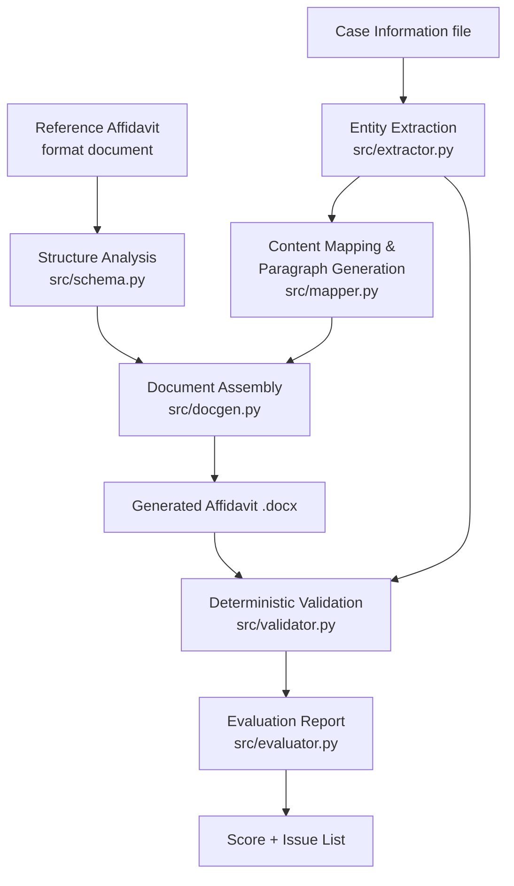

# Legal Document Generation & Evaluation Agent

An AI-assisted system that takes a reference **Affidavit in Reply** and a
set of case-specific facts, generates a new Affidavit in Reply that follows
the reference's structure, and then evaluates its own output against a set
of deterministic, LLM-independent checks. Built as a proof of concept for
one document type only, per the assignment's "Keep It Small" scope.

## What it does

1. Encodes the reference affidavit's ten-part structure and fixed phrases as
   a reusable schema (`src/schema.py`), rather than hard-coding one case's
   output.
2. Extracts case facts and reply points from a case-information file into a
   structured intermediate JSON (`src/extractor.py`).
3. Maps each reply point onto a numbered body paragraph and generates its
   text, either deterministically from fixed-phrase templates or,
   optionally, with an LLM polishing pass on top of the deterministic draft
   (`src/mapper.py`).
4. Assembles a formatted `.docx` that preserves the reference's headings,
   numbering, bold conventions and paragraph organisation
   (`src/docgen.py`).
5. Runs six deterministic checks against the generated document and
   produces a weighted, explained evaluation score with an issue list
   (`src/validator.py`, `src/evaluator.py`).

## Setup

- Python 3.10+
- Install dependencies:
  ```bash
  pip install -r requirements.txt
  ```
- Copy `.env.example` to `.env` and optionally set `ANTHROPIC_API_KEY`.
  **The system runs fully without a key** — it falls back to deterministic
  template generation, which is what the hosted demo link runs on by
  default (see "Working link" below).

## How to run

From a clean clone:

```bash
pip install -r requirements.txt

# Command line, deterministic mode:
python cli.py --no-llm

# Command line, LLM-polished mode (needs ANTHROPIC_API_KEY in the environment):
python cli.py

# Command line, to demonstrate the validation layer catching an error:
python cli.py --no-llm --inject-demo-error

# Interactive UI:
streamlit run app.py
```

CLI output goes to `outputs/generated_affidavit.docx` and
`outputs/evaluation_report.md`.

## Working link

`<ADD YOUR DEPLOYED LINK HERE — see "Deploying" below>`

## Video link

`<ADD YOUR LOOM / DRIVE LINK HERE>`

## Architecture



## Design decisions

- **Deterministic generation by default, LLM as an optional polish layer.**
  Because the schema and case facts are fully supplied (per the
  assignment's problem statement), a template-based generator already
  produces a structurally correct, reproducible document with zero
  external dependencies. The LLM call in `mapper.py` only rephrases each
  paragraph's wording — it never invents facts — and the deterministic
  draft is always computed and kept as the ground truth the hallucination
  checker diffs the LLM output against. This means the system is usable
  and demoable with no API key at all.
- **Field-label-driven extraction, not hard-coded parsing.** `extractor.py`
  parses `Label: value` lines and `Point N — Title [MOVE:...]` blocks
  generically, so a case-information file with the same field labels but
  different facts (or even a second matter) parses without code changes.
- **Schema as data, not logic.** `schema.py` holds the ten required parts,
  required-order list, and fixed phrases as plain data structures. A second
  document type would mean adding a new schema file, not rewriting the
  pipeline.
- **Six deterministic checks, not three.** The assignment asks for a
  minimum of three; respondent-number consistency, verification-paragraph
  count, required-sections presence, prayer lettering, deponent/jurat verb
  agreement, and a heuristic hallucination check are all included, each
  independent of any LLM call.
- **Pre-validation as well as post-validation.** The deterministic
  generation path structurally cannot produce a missing section or a
  numbering mismatch under normal operation — validation is there mainly to
  catch LLM-introduced drift and to demonstrate detection (see
  `--inject-demo-error`), fulfilling the "catches errors before / not only
  after" bonus in spirit.
- **What was rejected:** a general-purpose RAG/vector-DB pipeline, a
  multi-agent architecture, and support for multiple document types were
  all considered and rejected as out of scope — the assignment explicitly
  asks for a small, single-document-type proof of concept.

## Known limitations

- The extractor expects the case-information file to use the same field
  labels as the supplied sample (`Court:`, `Jurisdiction:`, `Point N — Title
  [MOVE:...]`, etc.). A case-information document with materially different
  labelling would need either a mapping table added to `FIELD_MAP` in
  `extractor.py`, or an LLM-based extraction fallback (not implemented).
- The hallucination check is a heuristic (token-diffing against the
  deterministic draft) rather than a semantic check — it can miss a
  hallucinated claim that reuses only words already present in the source
  facts, and can occasionally flag a legitimate word it hasn't seen before.
- Only one document type (Affidavit in Reply, Bombay High Court writ
  format) is supported, by design.
- A para-wise reply to the petition is out of scope, by design.
- The structure-order check assumes a single-page-flow document; it has not
  been tested against a version of the document containing extra optional
  sections beyond `schema.py`'s list.

## AI coding assistant use

This project — the pipeline design, all source files, the Streamlit UI, and
this README — was built with Claude (Anthropic) as an AI coding assistant,
based on the supplied assignment brief and reference materials.

## Deploying (for the working link)

The quickest option is **Streamlit Community Cloud**:
1. Push this repository to GitHub.
2. Go to [share.streamlit.io](https://share.streamlit.io), connect the repo,
   set the main file to `app.py`.
3. If you want the LLM-polish option to work in the hosted demo, add
   `ANTHROPIC_API_KEY` under the app's Secrets. If you'd rather not expose a
   key, leave it unset — the app clearly falls back to deterministic mode
   in the UI, satisfying the "pre-run demo mode" allowance in the brief.
4. Free-tier Streamlit apps sleep after inactivity; the first load after
   sleeping can take ~30–60 seconds to wake up.
